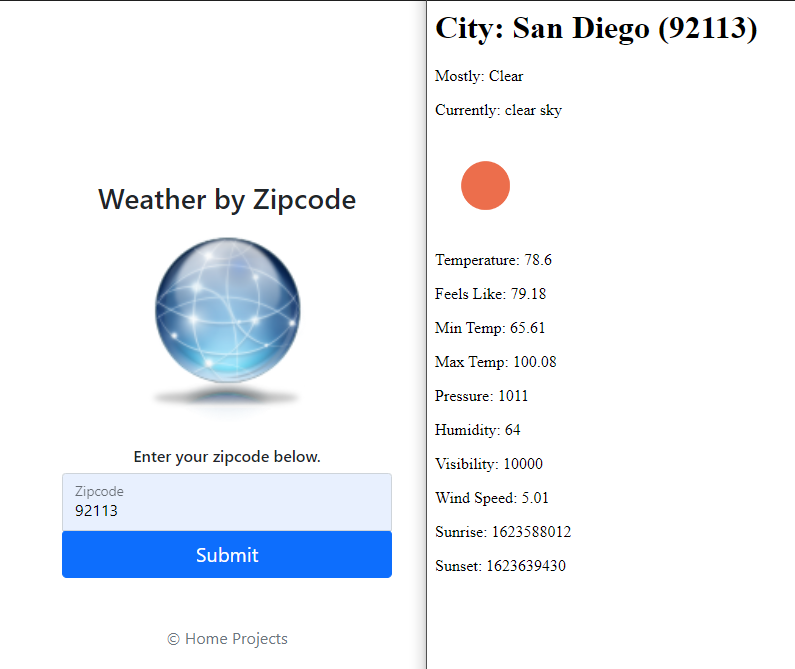

# WeatherApp
Have the user enter a zipcode and
the weather for that zipcode will be 
displayed.
JS | Node.js | Express | Bootstrap 
Completely implemented through command line using Hyper electron based terminal.
Weather API provided by openweather.org

